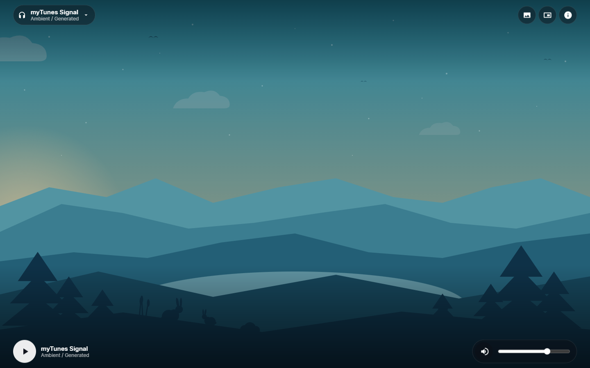
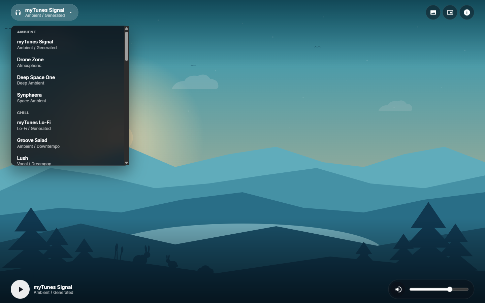
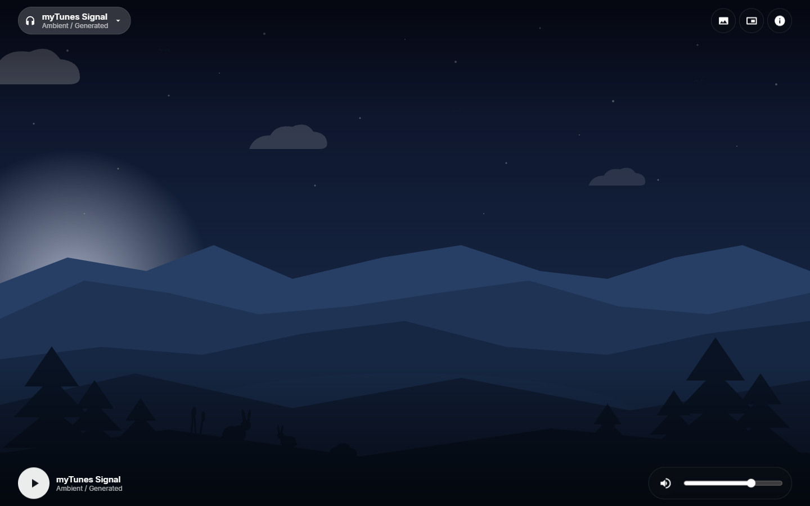
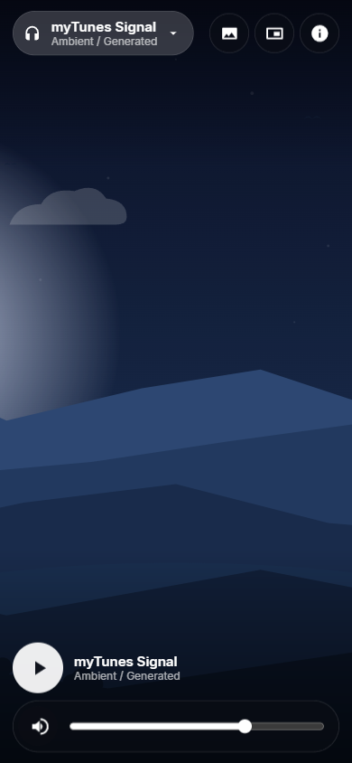

# myTunes

[](https://github.com/patbaumgartner/mytunes/actions/workflows/ci.yml)
[](https://github.com/patbaumgartner/mytunes/actions/workflows/codeql.yml)
[](https://tunes.patbaumgartner.com/)
[](#with-and-without-spring)
[](https://www.graalvm.org/)
[](#with-and-without-spring)
[](https://webassembly.org/)
[](#the-zero-javascript-rule)
[](LICENSE)
[](CONTRIBUTING.md)

**Live demo: <https://tunes.patbaumgartner.com/>** — deployed by CI from `main`, so it runs the
Spring build; this branch's variant is not deployed anywhere. (GitHub Pages serves no custom
headers, so the CSP and caching policy documented below apply to the nginx container, which
remains the reference deployment.)

A radio player inspired by [DevTunes FM](https://radio.madza.dev/). The `main` branch answers one
question:

> Can a complete Spring Boot application — the framework, the domain, **and the user interface** —
> be compiled from Java to WebAssembly and run entirely inside a browser, with no server?

**This branch is the control experiment.** It is the same application with Spring Boot and Spring
Modulith removed: the object graph is wired by nine hand-written constructor calls in `main()`.
Same modules, same interface, same tests, same zero-JavaScript rule — which makes the two branches
a direct measurement of what the framework costs inside a Wasm module. The numbers are in
[With and without Spring](#with-and-without-spring).

```
[mytunes] Java started in the browser in 20ms, wired by hand without a framework
[mytunes] interface ready
```

## Screenshots

Every pixel below is rendered by Java: the interface is built against the live DOM from inside
the WebAssembly module, and the animated landscapes are generated SVG scenes with a declarative
SMIL day-night cycle.



| Station menu | Night scene | Mobile |
| --- | --- | --- |
|  |  |  |

---

## Contents

- [What this is](#what-this-is) · [Why Java to WebAssembly](#why-java-to-webassembly)
- [With and without Spring](#with-and-without-spring)
- [Architecture](#architecture) · [Modules](#modules) · [The zero-JavaScript rule](#the-zero-javascript-rule)
- [Prerequisites](#prerequisites) · [Build from a clean clone](#build-from-a-clean-clone) · [Docker](#docker)
- [Tests](#tests)
- [Stored data](#stored-data) · [Stations and streams](#stations-and-streams) · [Artwork](#artwork)
- [Browser support](#browser-support) · [Mobile](#mobile) · [Media Session and mini player](#media-session-and-mini-player)
- [GraalVM Web Image: status and limits](#graalvm-web-image-status-and-limits) · [Known issues](#known-issues)

---

## What this is

myTunes is a single-page radio player: pick a station, press play, change the background, adjust the
volume. It looks and behaves like DevTunes FM. What makes it unusual is that **all of it is Java**.
The station catalogue, the player state machine, the preference store, the DOM construction, the
event handling and the audio control are Java classes compiled ahead of time into a WebAssembly
module by GraalVM Web Image.

There is no backend. Nothing is rendered on a server, and no API is called.

## Why Java to WebAssembly

The interesting part is not "compile Java to Wasm" — several projects do that. It is that
**WebAssembly has no access to the DOM**, so a browser UI written in Java needs an interop layer,
and the usual answer is to hand-write JavaScript for it. This project set out to avoid that. The
`main` branch additionally asks whether a framework as reflection-heavy and lifecycle-heavy as
Spring Boot survives the closed-world, ahead-of-time, single-threaded environment a Wasm module
runs in; this branch is the control run without the framework.

The adaptations that remain are documented at their call sites and summarised under
[GraalVM Web Image: status and limits](#graalvm-web-image-status-and-limits).

## With and without Spring

This branch removes Spring Boot 4.1.1 and Spring Modulith 2.1.0 from `main` and replaces the
application context with nine constructor calls in `main()`. Nothing else changed: same modules,
same interface, same tests, same pipeline. Both variants are built by the same pinned toolchain
(Oracle GraalVM 25.0.4, Binaryen `version_132`, `-Os`, a `wasm-opt -Oz` pass, `gzip -9`), so the
difference is the framework and nothing but the framework.

| Metric | `main` (Spring Boot + Modulith) | `without-spring-boot` | Δ |
| --- | --- | --- | --- |
| `mytunes.js.wasm` | 16,051,547 bytes (~16.1 MB) | 1,292,751 bytes (~1.3 MB) | **12.4× smaller** |
| `mytunes.js.wasm` on the wire (`gzip -9`) | ~6.8 MB | 533,043 bytes (~0.53 MB) | **~13× smaller** |
| Generated loader `mytunes.js` | 96,732 bytes | 96,217 bytes | unchanged |
| Container image (uncompressed) | ~80 MB | ~59 MB | **21 MB smaller** |
| In-browser startup (instantiated module → wired interface) | 137 ms, 22 beans | ~20 ms | **~7× faster** |

Docker Hub and the live demo are published by CI from `main` only, so the
[`patbaumgartner/mytunes`](https://hub.docker.com/r/patbaumgartner/mytunes) image (and its size
badge) always show the Spring build; this branch's image exists only where you build it.

What the numbers say, plainly: the framework accounted for roughly **92% of the module** and most
of its startup time. Two `@TargetClass` substitutions (`StackWalker`, `System.console()`) were
deleted along with it — they existed only because Spring Boot's startup path touched APIs Web Image
cannot support. What was given up: component scanning, dependency injection, the Modulith verifier
(re-expressed here as plain ArchUnit rules in `ModularityTests`) and Spring's configuration model —
none of which this application used at runtime beyond wiring those nine objects.

## Architecture

```
Docker (nginx, unprivileged)
  └── static assets only, no JVM, no jar
        ├── index.html          bootstrap shell, no behaviour
        ├── styles.css          presentation
        ├── backgrounds/, icons/, audio/
        ├── mytunes.js          GraalVM-generated loader  (the only script the page loads)
        └── mytunes.js.wasm     the entire application
                 ├── domain: stations, player, persistence, themes
                 └── browser: DOM, audio, localStorage, Media Session, Picture-in-Picture
```

The browser downloads the module, the generated loader instantiates it and calls `main()`, and
`main()` wires the object graph by hand inside the tab — nine constructor calls, no container.

## Modules

Module boundaries are enforced by ArchUnit rules in `ModularityTests` — the same allowed
dependencies Spring Modulith verified from the `package-info` declarations on `main`. The rule
that matters most is that **only `platform` may touch the browser**,
which is what keeps the domain unit-testable on a plain JVM even though the product only ever runs
as WebAssembly.

| Module | Responsibility | May depend on |
| --- | --- | --- |
| `stations` | Station catalogue and stream URLs | — |
| `themes` | Background artwork and accent colours | — |
| `persistence` | `Preferences`, versioned store, storage abstraction | — |
| `player` | Player state machine. No browser APIs at all | `stations`, `persistence` |
| `platform` | Every JavaScript interop call in the project | `persistence` |
| `ui` | Builds and renders the interface | `player`, `stations`, `themes`, `persistence`, `platform` |

## The zero-JavaScript rule

The repository contains **no `.js`, `.mjs`, `.cjs` or TypeScript source file**, no JavaScript DOM
bridge and no JavaScript audio adapter. The page loads exactly one script: the loader GraalVM
generates.

There is one exception, and it is deliberately visible. GraalVM Web Image offers no way to obtain a
browser global from Java — its interop API has no global accessor, and `@JS.Import` imports a
JavaScript *class* rather than an instance. This was verified against Oracle GraalVM 25.0.4,
GraalVM CE 25.2.4 and the Early Access build `jdk-25i3-25.0.4.1-ea.02`. Reaching the browser
therefore needs exactly two one-expression declarations, both in
[`BrowserWindow`](src/main/java/com/patbaumgartner/mytunes/platform/BrowserWindow.java):

```java
@JS("return document;") static native JSObject document();
@JS("return window;")   static native JSObject window();
```

Everything else — creating elements, registering listeners, controlling audio, reading
`localStorage`, constructing `MediaMetadata` via `Reflect.construct`, driving the Picture-in-Picture
window — is plain Java through `get`, `set` and `call`.

`NoHandwrittenJavaScriptTests` enforces this: it fails if any JavaScript or TypeScript source
appears anywhere in the repository, if any class other than `BrowserWindow` declares `@JS`, if
that surface grows beyond two expressions, or if `index.html` gains an inline script or an event
attribute.

## Prerequisites

| | |
| --- | --- |
| **Oracle GraalVM 25.0.4** | Required, not a preference. It is the only JDK that ships the Wasm backend (`lib/svm/tools/svm-wasm`) and a matching browser interop module. GraalVM CE carries a **diverged** copy of that API — CE 25.2.4 exposes `ThrownFromJavaScript` where this build needs `JSError` — so on CE even `./mvnw test` fails to compile. `sdk install java 25.0.4-graal` |
| **Binaryen 119+** | Web Image assembles output with `wasm-as`, which must be on `PATH` |
| **Docker** | Only for the container build |

## Build from a clean clone

```sh
export JAVA_HOME=/path/to/graalvm-jdk-25.0.4
export PATH="$JAVA_HOME/bin:/path/to/binaryen/bin:$PATH"

# One-time bootstrap. Repackages GraalVM's browser interop module as a Maven artifact so the
# whole build shares one compiler configuration.
./tools/install-webimage-api.sh

./mvnw -B native:compile      # produces target/mytunes.js and target/mytunes.js.wasm

# Assemble the site
mkdir -p target/site && cp -r src/main/web/. target/site/ \
  && cp target/mytunes.js target/mytunes.js.wasm target/site/
```

`tools/generate-artwork.py` and `tools/generate-audio.py` regenerate the backgrounds, icons and the
self-hosted station. Their output is committed, so a normal build does not need Python.

## Docker

The image needs no local JVM or GraalVM. CI publishes every tested **main** build to Docker Hub as
[`patbaumgartner/mytunes`](https://hub.docker.com/r/patbaumgartner/mytunes) (`latest` plus a
`sha-` tag per commit) — that published image is the Spring build. This branch is never
published, so to run the framework-free variant, build it from this checkout:

```sh
docker build -t mytunes:latest .
docker run -d --name mytunes -p 8099:8080 mytunes:latest
# http://localhost:8099
```

Readiness is `GET /healthz` (also wired as a `HEALTHCHECK`). The runtime stage is unprivileged
nginx containing only the bootstrap page, CSS, artwork, the generated loader and the Wasm module.
You can check the central claim yourself:

```sh
docker run --rm --entrypoint sh mytunes:latest -c "find / -name '*.jar' -o -name java -type f"   # empty
```

Generated Wasm is **not** committed. It is produced during the build.

## Tests

The suite is layered. Everything that can be verified without a browser is, and everything that
cannot is verified in one.

```sh
./mvnw -B test        # the JVM suite
```

| Layer | Covers |
| --- | --- |
| Unit | Player state machine, versioned persistence, station and background catalogues |
| Wiring | `PlayerModuleIntegrationTests` wires the `player` module with its real collaborators exactly as `main()` does, proving the graph composes off-browser |
| Modularity | `ModularityTests` — ArchUnit layer rules and a cycle check encoding the allowed dependencies per module |
| Architecture | `ArchitectureTests` — Taikai conventions over the authored classes |
| Constraint | `NoHandwrittenJavaScriptTests` — the zero-JavaScript rule |

Browser tests are **authoritative**, because the application only ever executes in a browser. They
are excluded from the default run because they need a built image, and skip themselves if it is
absent.

```sh
# Local build
./mvnw -B test -Dsurefire.excludes= -Dtest='MyTunesBrowserTests,MiniPlayerBrowserTests' \
  -DfailIfNoTests=false

# …or against the running container
./mvnw -B test -Dsurefire.excludes= -Dtest='MyTunesBrowserTests,MiniPlayerBrowserTests' \
  -DfailIfNoTests=false -Dmytunes.baseUrl=http://127.0.0.1:8099

# Container smoke tests: content types, cache headers, and that the image holds no JVM or jar
./mvnw -B test -Dsurefire.excludes= -Dtest=DockerSmokeTests -DfailIfNoTests=false \
  -Dmytunes.baseUrl=http://127.0.0.1:8099 -Dmytunes.dockerImage=mytunes:latest
```

They assert real behaviour, not intent: that `currentTime` actually advances, that the volume
element follows the slider, that state survives a reload, that the page loads exactly one script,
and that `docker run ... find / -name '*.jar' -o -name java` returns nothing. Screenshots at four
breakpoints and the console logs land in `target/diagnostics/` (uploaded as a CI artifact on
every run).

Module size and startup timing are recorded to `target/diagnostics/console/wasm-diagnostics.log`
on every browser run:

```
startup=[log] [mytunes] Java started in the browser in 20ms, wired by hand without a framework
mytunes.js.wasm=1292751 bytes
mytunes.js=96217 bytes
```

Coverage note, stated plainly: JaCoCo instruments JVM bytecode, and the `platform` and `ui`
classes execute only as WebAssembly where no Java agent exists, so they are excluded from
instrumentation and verified in a real browser instead. The domain they delegate to (stations,
player, persistence, themes) is fully unit tested on the JVM.

## Stored data

`localStorage`, through the Java interop layer. Nothing secret is stored; these are display and
playback preferences.

| Key | Meaning |
| --- | --- |
| `mytunes.schema` | Storage format version, currently `1` |
| `mytunes.station` | Selected station id |
| `mytunes.background` | Selected background id |
| `mytunes.volume` | `0.0`–`1.0` |
| `mytunes.muted` | `true` / `false` |

A record written by a **newer** schema is discarded rather than half-read, so a future format
degrades to defaults instead of restoring corrupt state. Unparseable values fall back individually.
Storage failures (private mode, exhausted quota) are contained: losing a volume preference must
never stop the radio.

## Stations and streams

The catalogue holds **eight categories, each with several channels** (30 in total), grouped in
the station menu.

| Category | Channels | Source |
| --- | --- | --- |
| Ambient | **myTunes Signal** (default), Drone Zone, Deep Space One, Synphaera | generated · SomaFM |
| Chill | **myTunes Lo-Fi**, Groove Salad, Lush, Fluid, Chillsynth FM, Radio Paradise Mellow | generated · SomaFM · Nightride FM · Radio Paradise |
| Beats | **myTunes Beats**, Beat Blender, Radio Paradise Global | generated · SomaFM · Radio Paradise |
| Bass | **myTunes Sub Signal**, Dub Step Beyond, EBSM | generated · SomaFM · Nightride FM |
| Electronic | **myTunes Pulse**, Space Station, cliqhop idm, Spacesynth FM | generated · SomaFM · Nightride FM |
| Trance | **myTunes Drift**, The Trip | generated · SomaFM |
| Wave | **myTunes Nightdrive**, Underground 80s, Vaporwaves, Nightride FM, Datawave FM | generated · SomaFM · Nightride FM |
| Hacker | **myTunes Terminal**, DEF CON Radio, Darksynth FM | generated · SomaFM · Nightride FM |

Every category **leads with a channel generated by `tools/generate-audio.py`** and served from
this repository — always available, same origin, no licensing question — and
`StationCatalogueTests` enforces exactly that. Generated channels loop seamlessly, since a
finite file stands in for a continuous station.

The third-party channels come from three providers — [SomaFM](https://somafm.com/),
[Nightride FM](https://nightride.fm/) and [Radio Paradise](https://radioparadise.com/) — all
verified to play in a real browser: an `Audio` element reaches `canplay` on every committed
stream.

`tools/generate-stations.py` keeps this honest: it re-verifies every committed third-party
stream the way a browser would use it (`--verify`), and proposes new CORS-verified candidates
per category from the open, key-free [Radio Browser](https://www.radio-browser.info/)
directory as ready-to-paste catalogue entries. Nothing lands automatically — a human reviews
the provider's terms and commits the entry, and `StationCatalogueTests` enforces the
invariants.

SoundCloud stays out deliberately: its API requires a registered `client_id`, which would ship
in plain sight inside the WebAssembly bundle, and its terms only sanction playback through
SoundCloud's own widget. `StationCatalogueTests` fails the build if any stream URL ever gains
credential-bearing parameters (`client_id`, signed-CDN `Policy`/`Signature`/`Key-Pair-Id`).

Caveats, stated plainly:

- **Stream availability changes independently of myTunes.** A URL that works today may not tomorrow.
- **Before any production or commercial use**, replace these with streams you own or are licensed to
  use, and honour each provider's terms.
- No API key, token, cookie or credential is committed. `secret-scan` passes.

## Artwork

The five backgrounds and nine icons are **original flat-design SVG** generated by
`tools/generate-artwork.py`, and the eight myTunes channels are loops synthesised by
`tools/generate-audio.py` — one per category, each a distinct deterministic arrangement. They
are covered by this repository's own licence. Each background is a small animated scene
(declarative SMIL inside the image, so the zero-JavaScript rule is untouched): the sun crosses
the sky in about a minute and hands over to a cratered moon travelling the same way, the scene
darkens towards midnight under a starfield, clouds drift, birds glide past, ripples play on the
water, reeds sway, fireflies come out around midnight, and a pair of rabbits watches from the
foreground knoll — one of them twitching an ear now and then.

DevTunes FM serves wallpapers sourced from wallhaven. Their redistribution terms are not
established, so **none are reused**, and `BackgroundCatalogueTests` asserts that all artwork is
served from this repository.

## Browser support

Verified in Chromium via Playwright. Requires WebAssembly with GC and exception handling, so a
current Chromium, Firefox or Safari. Node 22–24 needs `--experimental-wasm-exnref`.

The module is **~1.3 MB uncompressed** (1,292,751 bytes): release builds omit `-g`, compile with
`-Os`, and the container build runs a `wasm-opt -Oz` pass (rebuild with `-Pwasm-debug` when
hunting a browser-side crash). On the wire it is **~0.53 MB**: the image build precompresses
every compressible asset at `gzip -9` and nginx serves the `.gz` bytes directly (`gzip_static`),
marked immutable. GitHub Pages applies its own gzip. With Spring Boot and Spring Modulith
compiled in, the same pipeline produces a ~16 MB module (~6.8 MB on the wire) — the full
comparison is under [With and without Spring](#with-and-without-spring). Startup from navigation
to a rendered interface is effectively instant locally.

## Mobile

Verified at 390×844 and 360×640. The transport and volume rows stack to full width, touch targets
stay at the 44 px minimum, and `env(safe-area-inset-bottom)` is respected. Zero console errors at
every breakpoint.

Browser autoplay policy is respected rather than worked around: the first audible playback needs a
real tap. iOS does not expose volume to script, so the slider is inert there while mute still works —
a platform rule, not a bug.

## Media Session and mini player

Both are feature-detected and degrade to nothing where unsupported.

**Media Session** publishes title, station, album and artwork, and handles play, pause, next and
previous, which is what drives lock-screen and keyboard media keys.

**Document Picture-in-Picture** opens a floating always-on-top mini player carrying the full
transport — previous/play/next, mute and volume — wired to the same player state as the main
page. `requestWindow()` returns a second `Window`, which reaches Java as an ordinary
`JSObject`, so the mini player is built with the same Java DOM vocabulary and needs no extra
JavaScript.

One limit stated honestly: the mini player stays visible while the tab is hidden or you work in
other applications, but **it cannot outlive the browser process**. No web application can keep a
window open after the browser that owns it is closed. That would require an installed native
application, and no amount of browser API makes it possible.

## GraalVM Web Image: status and limits

Web Image is **experimental**. Limits that shaped this code, all found by building and running:

1. **Single-threaded.** No `Thread`, no `ScheduledExecutorService`, no scheduling of any kind.
2. **`StackWalker` always throws.** On `main` this forces a substitution because Spring Boot's
   `deduceMainApplicationClass()` walks the stack; without Spring nothing walks the stack and the
   substitution is deleted.
3. **`java.io.Console` cannot link.** On `main` Spring Boot's logging setup reaches it, needing a
   `System.console()` substitution; without Spring nothing touches it and the substitution is
   deleted.
4. **`@JS.Import`, `@JS.Export` and `JSObject` subclasses are unimplemented** in shipping releases.
5. **Java stack traces are empty inside Wasm.** Diagnosis needs `-g` plus a raised
   `Error.stackTraceLimit` to read named Wasm symbols.
6. **The build requires Oracle GraalVM**, because the interop API is a JDK module.

## Known issues

- **Live track titles are not shown.** The original reads them from its own playlist service.
  myTunes has no server, and ICY stream metadata is not exposed to browser JavaScript, so per-track
  titles are not obtainable. The station name and genre are shown instead; `PlayerState.nowPlaying`
  is in place for when a source exists.

## Contributing

Contributions are welcome — read [CONTRIBUTING.md](CONTRIBUTING.md) for the toolchain, the build
commands CI actually runs, and the one rule that is different here (no hand-written JavaScript).
Security reports go through [SECURITY.md](SECURITY.md), never public issues.

## Licence

[Apache License 2.0](LICENSE). That covers the code and the generated artwork and audio, which is
the point of generating them rather than reusing someone else's: the whole bundle can be
redistributed under one clear licence.

Third-party streams are not covered and remain subject to their providers' terms.
